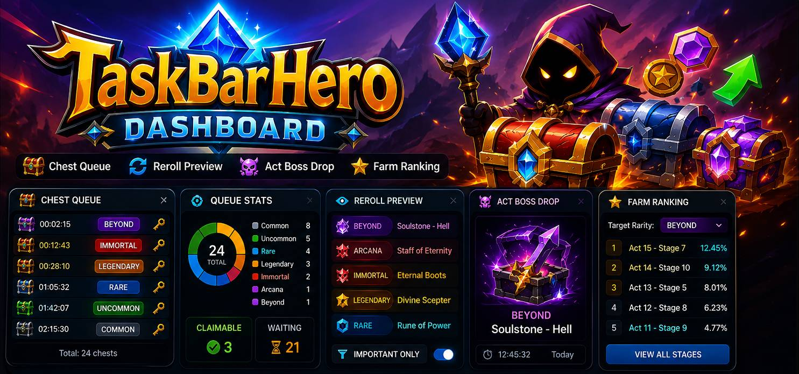

<p align="center">
  
</p>

<h1 align="center">🧰 TaskBarHero Dashboard</h1>

<p align="center">
  
  
  
  
  
</p>

<p align="center">
  A live, read-only desktop dashboard for <strong>TaskBarHero</strong> chest queues, rerolls, and farming recommendations.
</p>



## ✨ Highlights

* 📦 Tracks Common Treasure Chest and Stage Treasure Chest queues.
* ⏱️ Shows unlock times, rewards, item keys, rarity totals, and queue statistics.
* 🗺️ Ranks stages by selected item rarity using downloaded game data.
* 🛡️ Runs read-only through captured server responses; it does not modify game memory or packets.

## 🚀 Quick Start

### 📦 Release Builds

Download the bundle for your platform from a GitHub release, install or extract it, then run `TaskBarHeroDashboard`.

Release builds are produced for:

* Linux x86_64
* Windows x86_64

Windows builds are generated by CI and may need manual verification on real Windows hosts.

### 🧑‍💻 From Source

Requirements:

* Rust stable
* Tauri 2 system dependencies for your OS
* `wasm32-unknown-unknown` Rust target
* Trunk

Install Rust tools if needed:

```bash
rustup target add wasm32-unknown-unknown
cargo install trunk tauri-cli
```

The proxy is built as part of the Tauri app — no separate build step needed.

Run the app in development:

```bash
cargo tauri dev
```

The Tauri app starts the proxy automatically in-process.

## 🧭 Features

### 📦 Chest Queue

Displays Common Treasure Chests, Stage Treasure Chests, unlock times, and rewards.

When entering an Act Boss stage or switching between stages that would result in a different chest, the game generates a completely new timed chest queue. This tab lets you inspect that generated queue and you can decide whether to keep it or reroll again.

### 🗺️ Farm Ranking (WIP)

Displays the best stages to farm for a selected rarity.

Supported rarities:

* COMMON
* UNCOMMON
* RARE
* LEGENDARY
* IMMORTAL
* ARCANA
* BEYOND
* CELESTIAL
* DIVINE
* COSMIC

### ⚙️ Settings

Configures refresh interval, log level, automatic game launch, and catalog asset updates.

## 🛡️ Disclaimer

* The dashboard is read-only.
* It does not hook into TaskBarHero.
* It does not read or write TaskBarHero process memory.
* It does not modify packets or game data.
* All displayed information comes from data already sent by the game servers and captured through the local proxy.
* Use at your own risk.
